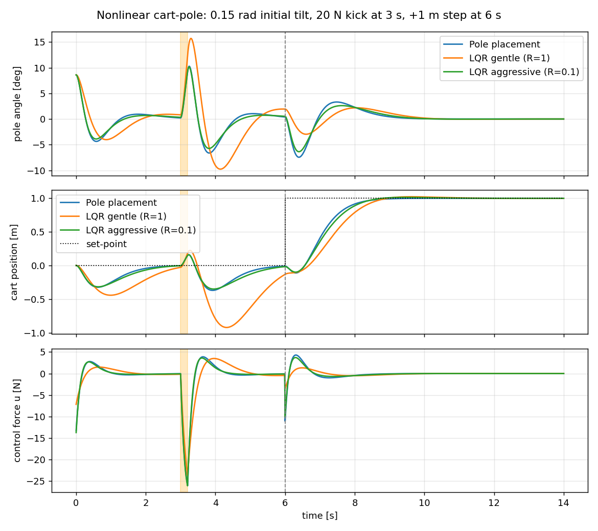
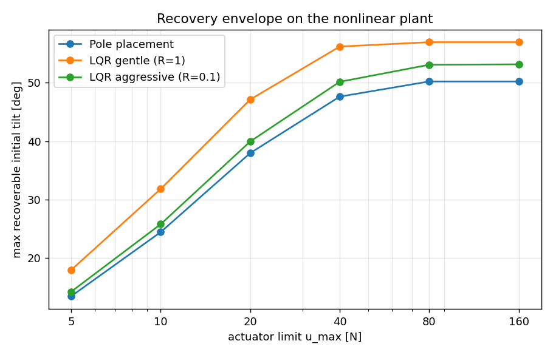

# inverted-pendulum-control

倒單擺（cart-pole）的狀態回授控制：把**極點配置**和 **LQR** 放在同一個非線性模型上比較，附互動式 demo。



## 內容

| 檔案 | 說明 |
|---|---|
| `cartpole.py` | 模型與工具：線性化 `(A, B)`、可控性、`pole_placement_gain`、`lqr_gain`、非線性動力學、RK4 積分、批次模擬 `simulate()` |
| `compare_controllers.py` | 兩個實驗（下方），輸出 `docs/comparison.png`、`docs/recovery_envelope.png` 與 Markdown 表格 |
| `interactive_demo.py` | matplotlib 互動介面：開始/暫停、推一下、切換控制器、拖桿長與目標位置，畫面上直接顯示 rank、eig(A)、eig(A−BK)、K、u |
| `tests/` | pytest：線性化與非線性模型的數值 Jacobian 一致、開迴路不穩定但可控、閉迴路穩定、控制器能從小角度回正、無控制會倒 |

## 模型

狀態 `X = [x, ẋ, φ, φ̇]`，`φ` 為擺桿偏離鉛直向上的角度，輸入 `u` 為推車的水平力。非線性方程（CTMS 慣例，`I = mL²`）：

```
(M + m) ẍ + b ẋ − m L φ̈ cos φ + m L φ̇² sin φ = u
(I + m L²) φ̈ − m g L sin φ = m L ẍ cos φ
```

在 `φ = 0` 線性化得到 `Ẋ = AX + Bu`；`rank([B AB A²B A³B]) = 4` 所以可控，`eig(A)` 有一個正實部（開迴路不穩定）。兩種設計都給出 `u = −K (X − X_ref)`：

- **極點配置**：`scipy.signal.place_poles`，閉迴路極點放在 `−3.0, −3.1, −3.2, −3.3`
- **LQR**：解連續 Riccati 方程 `scipy.linalg.solve_continuous_are`，`K = R⁻¹Bᵀ P`
  - gentle：`Q = diag(10, 1, 10, 1)`, `R = 1`
  - aggressive：`Q = diag(10, 1, 100, 1)`, `R = 0.1`

模擬時**控制器用線性模型設計、受控體用非線性模型**（RK4，dt = 10 ms），所以結果包含線性化誤差與大角度效應。

## 實驗 1：擾動與追蹤

初始傾角 0.15 rad，3 s 時給 20 N 持續 0.2 s 的推力，6 s 時目標位置從 0 跳到 +1 m。指標分別在「只有推力」和「只有步階」的獨立模擬上計算，避免互相干擾：

| controller | K | kick: peak angle [deg] | kick: settle <1 deg [s] | step: settle x <2 cm [s] | step: peak angle [deg] | peak u [N] | effort ∫u² |
|---|---|---|---|---|---|---|---|
| Pole placement | [-11.02 -14.12 88.24 27.88] | 10.2 | 2.03 | 2.62 | 7.6 | 26.0 | 128 |
| LQR gentle (R=1) | [-3.16 -5.02 47.69 14.92] | 15.1 | 3.67 | 4.05 | 4.3 | 23.7 | 112 |
| LQR aggressive (R=0.1) | [-10.00 -13.24 91.42 27.25] | 9.9 | 1.31 | 2.54 | 6.7 | 26.1 | 124 |

觀察：
- `R` 就是「多在乎控制力」的旋鈕。`R = 1` 的 LQR 用最少的力（effort 112），代價是推力後的最大傾角較大（15°）、回到目標位置慢（4 s）；但因為動作溫和，步階時擺桿只偏 4.3°。
- 把 `Q` 的角度權重拉高、`R` 降到 0.1，LQR 的 K 幾乎收斂到極點配置的 K——兩種方法在這組參數下本質上是同一個控制器，只是一個用極點、一個用代價函數描述。

## 實驗 2：致動器飽和下的回正範圍

真正的差異出現在有力量上限的時候。對每個 `u_max`，用二分法找出各控制器仍能回正的最大初始傾角：



| u_max [N] | 5 | 10 | 20 | 40 | 80 | 160 |
|---|---|---|---|---|---|---|
| Pole placement | 13.5 | 24.4 | 38.0 | 47.6 | 50.2 | 50.2 |
| LQR gentle (R=1) | 18.0 | 31.8 | 47.1 | 56.2 | 57.0 | 57.0 |
| LQR aggressive (R=0.1) | 14.2 | 25.8 | 40.0 | 50.2 | 53.1 | 53.2 |

增益小的 gentle LQR 反而能從更大的角度救回來：高增益控制器在大角度時要求的力遠超過 `u_max`，飽和之後等於失去回授；溫和的控制器要求的力較接近可用範圍，飽和時間短。`u_max` 超過 80 N 之後上限不再是力量而是線性化本身（約 50–57°）。

## 執行

```bash
pip install -r requirements.txt
python compare_controllers.py          # 產生兩張圖與表格
python interactive_demo.py             # 互動 demo
python -m pytest                       # 測試
```

互動 demo 用 Microsoft JhengHei 顯示中文，非 Windows 環境會回退到 SimHei / Arial。

## 授權

MIT
